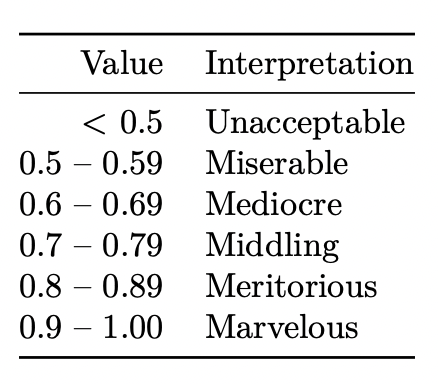

```{r setup, include=FALSE}
knitr::opts_chunk$set(
	message = FALSE,
	warning = FALSE,
	include = TRUE,
	fig.align = "center")
rm(list = ls())
cat("\014")
```

# **Packages** {.unnumbered}

First we load all the necessary packages for the analysis.

```{r}
library(psych)
library(corrplot)
library(ggplot2)
library(car)
library(naniar)
library(REdaS)
library(zoo)
library(foreign) 
library(lavaan)
library(lavaanPlot)
library(ggcorrplot)
library(lares)
library(MVN)
library(dplyr)
library(knitr)
library(dplyr)
library(kableExtra)
```

# **Data**

Here we load the data and select only the necessary value for the analysis.

```{r}
df <- read.csv2('Case Study III_Structural Equation Modeling.csv', na.strings = '999', sep = ',')
df <- df[, c(1:23, 25:36)]

DT::datatable(df)
```

## **Dimensions**

To see how much data we have we look at the dimensions of the data.

```{r}
dim_before_na <- dim(df)
dim_before_na
```

We see that we have `r dim_before_na[1]` rows and `r dim_before_na[2]` columns. 

## **Summary Statistics**

Here we use summary statistics on the data.

```{r}
DT::datatable(describe(df))
```

## **Missing Analysis**

As not all further analysis do work with missing values we need to check the existence of them. 

```{r}
gg_miss_var(df, show_pct = TRUE)
```

We see that there are a lot of columns which have some percentage of values missing. To see if the missing values are in some observations only or if they are spread out between a lot of the observations we use a plot which highlights the missing values in every observation. 

```{r}
naniar::vis_miss(df)
```

If we look at this plot though we see that the missing values are in a lot of the observations. Most EFA methods do not work well with missing values. For the Confirmatory Analysis we will need to choose a method which can handle missing values.

## **Dimensions after list wise deletion**

Based on the input of the assistant we will use list wise deletion for EFA. 

```{r}

dim_after_na <- dim(na.omit(df))
dim_after_na

na_remove_count <- dim_after_na - dim_before_na
na_remove_count[1] <- abs(na_remove_count[1])

```

Thus, we remove `r na_remove_count[1]` with list wise deletion which is a lot of observations compared to the size of the whole dataset. 

```{r}
# We do list-wise deletion as asked by the TA
df_listwise <- na.omit(df)
```

# **Assumptions for EFA**

**From Assistant**
Please only consider variables image1 to image22, and use list wise deletion to handle missing data before starting exploratory factor analysis.

## **Basic Assumptions**

Here we select the images which whe need for the EFA.

```{r}
df_1 <- df_listwise[,1:22]
```

### **Normality - Shapiro Wilk's test**

In this part we check if the data is normally distributed.

```{r}

apply(df_1, 2, shapiro.test)

```

We reject the null-hypothesis for all variables and thus don't accept normality of the data. 

### **Multivariate normality - Mardia's Multivariate Normality Test**

To say the data are multivariate normal:

• z-kurtosis < 5 (Bentler, 2006) and the P-value should be ≥ 0.05.
• The plot should also form a straight line (Arifin, 2015).

```{r}

MVN::mvn(df_1, mvnTest = "mardia", multivariatePlot = "qq", desc = FALSE)

```

The data are not normally distributed at multivariate level. Our extraction method PAF can deal with this
non-normality. 

### **Multicolinearity**

Here we check for multicolinearity in the data. First of all we will do a correlation plot and then a correlation ranking plot. 

```{r}

# Correlation Values Matrix
M <- cor(df_1)

# P-Value
p.mat <- cor_pmat(df_1)

```

<center>**Correlation Plot**</center>

Here we see the correlation plot of the images. 

```{r}

# Correlation Plot
ggcorrplot(M, hc.order = TRUE, type = "lower", lab = TRUE, p.mat = p.mat, sig.level=0.05, lab_size = 2, tl.cex = 10,outline.col = "white", ggtheme = ggplot2::theme_minimal(), colors = c("#823038", "white", "#2596be")) 

```

We see that there are some correlations between the images.  

<center>**Correlation Ranking**</center>

Here we show the highest correlation from the plot before.

```{r}

# Ranked Cross-Correlations
corr_cross(df_1, # name of dataset
  max_pvalue = 0.05, # display only significant correlations (at 5% level)
  top = 9 # display top 10 couples of variables (by correlation coefficient)
)


```

As we can see, We have some multicolinearity amongst the variables, at least 6 variables can be considered with high-colinearity. Im3+Im4, Im1+Im2, Im6+Im7, Im4+Im5, Im8+Im10 and Im8+Im14.

<center>

{width="400px"}

[A guide to appropriate use of Correlation coefficient in medical research](https://www.ncbi.nlm.nih.gov/pmc/articles/PMC3576830/#:~:text=A%20correlation%20coefficient%20of%20zero,between%20%E2%88%921%20and%20%2B1.)

</center>

## **Factors Analysis Assumptions**

Here we check the assumptions needed for factor analysis.

### **Kaiser-Meyer-Olkin test (KMO)**

First of all we look at the kaiser-meyer-olkin test which checks the sampling adequacy of all of our images. Thereby a score classifies the adequacy as it can be seen in the picture below.  

<center>

{width="250px"}

[KMO: Find the Kaiser, Meyer, Olkin Measure of Sampling Adequacy](https://www.rdocumentation.org/packages/psych/versions/2.3.3/topics/KMO)

</center>

**KMO Index**

Now we show the KMO value for all of our images.  

```{r}
KMOTEST <- KMO(M)
sort(KMOTEST$MSAi)
```

As one can see most KMO Index are either Meritorious or  Marvelous. Im6 is the lowest KMO index being Middling.

**KMO Overall Measure of sampling adequacy**

From all of these scores a general sampling adequacy can be computed.

```{r}
KMOTEST$MSA
```

With 0.87 the overall sampling adequacy is very high.

### **Bartlett's Test of Sphericity**

This test checks if there are correlations between the variables as EFA can not be done if there wouldn't be.

```{r}
cortest.bartlett(df_1)
```

The test says that EFA can be done as the test indicates a p-value of 0 (P-value \= 0) and thus we can reject the null hypothesis that the correlation matrix look like the identity matrix.

# **Exploratory Factor analysis**

Now we do an exploratory factor analysis of our images. 

## **Determine the number of factors**

To determine the number of factors there are five different criterions one can use which are listed below. 

1. Kaiser’s eigenvalue > 1 rule.
2. Cattell’s scree test.
3. Parallel analysis.
4. Very simple structure (VSS).
5. Velicer’s minimum average partial (MAP).

### **Kaiser's eigevalue > 1 rule**

Factors with eigenvalues > 1 are retained. Eigenvalue can be interpreted as the proportion of the information
in a factor. The cut-off of 1 means the factor contains information = 1 item. Thus it is not worthwhile
keeping factor with information < 1 item.

```{r}

fa_result <- fa(df_1, rotate = "varimax", fm = "pa")

factors_kaiser <- sum(fa_result$e.values>1)

```

According to the Kaiser-Criterion, we would use `r factors_kaiser` factors.

### **Catell's scree test**

For the scree test criterion one needs to look at the plot of the initial eigenvalues against the used factors and choose the value where there is a dent in the curve. Here we did a factor analysis using rotation **varimax** and plotted the initial eigenvalues

```{r}

fa_result <- fa(df_1, rotate = "varimax", fm = "pa")
n_factors <- length(fa_result$e.values)
scree <- data.frame(Factor_n =  as.factor(1:n_factors), Eigenvalue = fa_result$e.values)

ggplot(scree, aes(x = Factor_n, y = Eigenvalue, group = 1)) +
  geom_point() + geom_line() +
  xlab("Number of factors") +
  ylab("Initial eigenvalue") +
  labs( title = "Scree Plot",
        subtitle = "(Based on the unreduced correlation matrix)") +
  geom_hline(yintercept = 1, color="#2596be") + theme_minimal() 

```

As one can see from the plot the number of factors to choose would either be 7 or 8. Additionally in the scree plot one can see the kaiser criterion which selects all the factors above the blue line of eigenvalue > 1.

### **Parallel analysis**

Here we do a parallel factor analyis.

```{r}

parallel <- fa.parallel(df_1, fm = "pa", fa = "fa")

print(parallel)

```

As we can see in parallel analysis, it also suggest 6 factors, nevertheless, factors up to 7 or 8 can also be considered.

### **Very simple structure (VSS) criterion and Velicer’s minimum average partial (MAP) criterion**

Here we do the VSS and MAP criterion.

```{r}

vss(df_1, rotate = "varimax", fm = "pa")

```


VSS indicates 1 or 2 factors (vss1 largest at 1 and 2 factors), while MAP indicates 8 factors (map smallest at 8
factors).

[VSS criterion for the number of factors (in R's psych package)](https://stats.stackexchange.com/questions/32669/vss-criterion-for-the-number-of-factors-in-rs-psych-package)


## **Extraction Method**

Our data are not normally distributed, hence the extraction method of choice is principal axis factoring
(**PAF**), because it does not assume normality of data (Brown, 2015). The rotation method is **varimax**.

We run EFA by

1. fixing the number of factors as decided from previous step. 6 or 8 factors are reasonable.
2. choosing an appropriate extraction method. We use PAF, fm = "pa" (Principal Axis Factoring).
3. choosing an appropriate rotation method. We use varimax, rotate = "varimax".


### **6 Factors**

We will compute the loadings with 6 factors and **varimax rotation**

**What we need to look for:**

1.  Factor loadings

Multiple threshold exist (as many rules of thumb), in our analysis we will use the standard 0.4 cut-off.

[What thresholds should I use for factor loading cut-offs?](https://imaging.mrc-cbu.cam.ac.uk/statswiki/FAQ/thresholds)

2.  Communalities

We use the standard cut-off of 0.5, all above are good.

```{r}

fa_result <- fa(df_1, nfactors = 6, fm = "pa", rotate = "varimax")

print(fa_result, cut = 0.4, digits = 3)

```

<center>

{width="250px"}

[Exploratory factor analysis and Cronbach's alpha Questionnaire Validation Workshop, 10/10/2017, USM Health Campus](https://wnarifin.github.io/workshop/qvw2017/efa.pdf)

</center>

**1.  Factor loadings**

We can see that we have 3 cross-loadings, Im7, Im17 and Im19. 

Cross-Loadings (Measured with Complexity measure: *com* > 1):

**Im17 > Im19 > Im7 > 1**


**2.  Communalities**

On the table, it is column **h2** 

Low Communalities are : 

**Im9 < Im11 < Im16 < 0.5**


#### Removing Im17 (Lowest Communality and High Complexity)


```{r}

fa_result <- fa(df_1[!names(df_1) %in% c("Im17")], nfactors = 6, fm = "pa", rotate = "varimax")

print(fa_result, cut = 0.4, digits = 3)

```


#### Removing Im18 (Lowest loadings and High Complexity)


```{r}

fa_result <- fa(df_1[!names(df_1) %in% c("Im17","Im18")], nfactors = 6, fm = "pa", rotate = "varimax")

print(fa_result, cut = 0.4, digits = 3)

```


#### Removing Im8 (Cross-loadings (High Complexity))


```{r}

fa_result <- fa(df_1[!names(df_1) %in% c("Im17","Im18","Im8")], nfactors = 6, fm = "pa", rotate = "varimax")

print(fa_result, cut = 0.4, digits = 3)

```


#### Removing Im19 (Low Communality and High Complexity)


```{r}

fa_result <- fa(df_1[!names(df_1) %in% c("Im17","Im18","Im8","Im19")], nfactors = 6, fm = "pa", rotate = "varimax")

print(fa_result, cut = 0.4, digits = 3)

```

### **6 Factors - Conclusion**

We removed **Im17, Im18, Im8 and Im9** until achieving clear loadings separation. 

```{r , fig.width = 12, fig.height=12}

fa.diagram(fa_result, sort = TRUE, adj = 1, rsize = 4, e.size = 0.07, main = "Factors Analysis with 6 factors", digits = 2, l.cex = 1)

```

Most Factors have good loadings (at least 2 above 0.7), while PA6 has only 2 variables loaded.


### **8 Factors**

We will redo the same analysis with 8 factors this time and using **varimax** rotation as well.

```{r}

fa_result <- fa(df_1, nfactors = 8, fm = "pa", rotate = "varimax")

print(fa_result, cut = 0.4, digits = 3)

```


**1.  Factor loadings**

We can see that we have 2 cross-loadings, Im8 and Im15. Therefore 1 less cross-loadings than 6 Factors Analysis.

Cross-Loadings (Measured with Complexity measure: *com* > 1):

**Im15 > Im8 > 1**


**2.  Communalities**

On the table, it is column **h2** 

Low Communalities are : 

**Im9 < Im11 < 0.5** (same low items communalities than in 6 Factor analysis )


#### Removing Im15 (Low Communality and High Complexity)

```{r}

fa_result <- fa(df_1[!names(df_1) %in% c("Im15")], nfactors = 8, fm = "pa", rotate = "varimax")

print(fa_result, cut = 0.4, digits = 3)

```

#### Removing Im8 (Low Communality and High Complexity)


```{r}

fa_result <- fa(df_1[!names(df_1) %in% c("Im15","Im8")], nfactors = 8, fm = "pa", rotate = "varimax")

print(fa_result, cut = 0.4, digits = 3)

```


### **8 Factors - Conclusion**

We removed **Im15, Im8** until achieving clear loadings separation. Therefore we removed 2 variables less than 6 Factors Analysis done previously

```{r , fig.width = 12, fig.height=12}

fa.diagram(fa_result, sort = TRUE, adj = 1, rsize = 4, e.size = 0.07, main = "Factors Analysis with 8 factors", digits = 2, l.cex = 1)

```

Most Factors have nice loadings (at least 2 above 0.7), but **PA8** has 2 variables with only 0.62-0.69 loadings (but close to 0.7).  


### **Deciding between 6 or 8 Factors**

Here we show the results of the final factor analysis with 6 and 8 Factors and then evaluate how we decided between the two solutions. 

```{r}

fa_result6 <- fa(df_1[!names(df_1) %in% c("Im17","Im18","Im8","Im19")], nfactors = 6, fm = "pa", rotate = "varimax")
fa_result8 <- fa(df_1[!names(df_1) %in% c("Im15","Im8")], nfactors = 8, fm = "pa", rotate = "varimax")

fa_result6
fa_result8

```

We can see that for **6 Factors Analysis**, we obtain a **cumulative proportion variance** of 0.73. In total, the extracted factors explain **73% of the variance**.

For **8 Factors Analysis**, we obtain a **cumulative proportion variance** of 0.77. In total, the extracted factors explain **77% of the variance**.

BIC is lower with 8 factors than 6 factors, therefore may allow more generalization in future sample. 

We should also check the root mean square error of approximation (RMSEA). An better value should be closer to 0. In **6 Factors Analysis** we have **0.067** and in **8 Factors Analysis** we have **0.052** (closer to 0). 

Finally, we must check the Tucker-Lewis Index (TLI). An acceptable value must be over 0.9. In **6 Factors Analysis** we have **0.946** and in **8 Factors Analysis** we have **0.964**. 

Therefore **8 Factors Analysis** is overall better, with better BIC, RMSR and TLI and also explain more the total variance with **77%**. 

[Choosing the Optimal Number of Factors in Exploratory Factor Analysis: A Model Selection Perspective](https://quantpsy.org/pubs/preacher_zhang_kim_mels_2013.pdf)


### **Labeling 8 Factors** 

Here we label the 8 factors according to the questions asked to receive the images which load on to the factor 

```{r}

colnames(fa_result8$loadings) <- c("Shopping Experience", "Store Decoration","Luxury Brands","French Culture","Product Assortment","Gourmet Food","Trendiness","Professionalism")

Shopping_Experience <- c("Im20","Im21","Im22")
Store_Decoration <- c("Im3","Im4","Im5")
Luxury_Brands <- c("Im11","Im12","Im13")
French_Culture <- c("Im6","Im7","Im9")
Product_Assortment <- c("Im1","Im2")
Gourmet_Food <- c("Im10","Im14")
Trendiness <- c("Im17","Im18")
Professionalism <- c("Im16","Im19")

```

And after renaming the factors we can now plot the loadings of  the factors. 

```{r , fig.width = 12, fig.height=12}

fa.diagram(fa_result8, sort = TRUE, adj = 1, rsize = 4, e.size = 0.061, main = "Conclusion of Factors Analysis - with 8 labeled factors", digits = 2, l.cex = 1)

```

### **Internal consistency reliability**

Our next step is to assess the internal consistency reliability of the factors that were identified through the EFA. To accomplish this, we will use **Cronbach's alpha**. We will evaluate the reliability of each factor individually by incorporating only the chosen items for that particular factor.

We need to look at:

**1. Cronbach's alpha** (raw_alpha) which indicates the internal consistency reliability as well as **2. Corrected item-total correlation** (average_r)

The interpretation is detailed as follows
(DeVellis, 2012, pp. 95–96):

<center>
{width="500px"}

[EFA and Cronbach's alpha](https://wnarifin.github.io/workshop/qvw2017/efa.pdf)


**Shopping Experience**

```{r}
alpha.pa1 <- psych::alpha(df_1[Shopping_Experience])
alpha.pa1$total
```

raw_alpha is over 0.7 and average items correlation is above 0.5

**Store Decoration**

```{r}
alpha.pa1 <- psych::alpha(df_1[Store_Decoration])
alpha.pa1$total
```

raw_alpha is over 0.7 and average items correlation is above 0.5

**Luxury Brands**

```{r}
alpha.pa1 <- psych::alpha(df_1[Luxury_Brands])
alpha.pa1$total
```

raw_alpha is over 0.7 and average items correlation is above 0.5

**French Culture**

```{r}
alpha.pa1 <- psych::alpha(df_1[French_Culture])
alpha.pa1$total
```

raw_alpha is over 0.7 and average items correlation is above 0.5

**Product Assortment**

```{r}
alpha.pa1 <- psych::alpha(df_1[Product_Assortment])
alpha.pa1$total
```

raw_alpha is over 0.7 and average items correlation is above 0.5

**Gourmet Food**

```{r}
alpha.pa1 <- psych::alpha(df_1[Gourmet_Food])
alpha.pa1$total
```

raw_alpha is over 0.7 and average items correlation is above 0.5

**Trendiness**

```{r}
alpha.pa1 <- psych::alpha(df_1[Trendiness])
alpha.pa1$total
```

raw_alpha is over 0.7 and average items correlation is above 0.5

**Professionalism**

```{r}
alpha.pa1 <- psych::alpha(df_1[Professionalism])
alpha.pa1$total
```

raw_alpha is over 0.7 and average items correlation is above 0.5


Our assessment suggests that the factors extracted are reliable, and therefore it is advisable to retain all the items related to these factors.


## **Dimensions by which Galeries Layfayette is perceived?**

Here we show the dimensions by which galeries layfayette is perceived according to EFA. 

```{r , fig.width = 12, fig.height= 12}

fa.diagram(fa_result8, sort = TRUE, adj = 1, rsize = 4, e.size = 0.061, main = "Galeries Lafayette - Perception Dimensions", digits = 2, l.cex = 1)

```

**Dimensions Definitions:**

  **Product Assortment**: This group pertains to the variety and range of products offered by the store.

  **Store Decoration**: This group pertains to the aesthetic elements of the store's interior and exterior, such as the artistic and creative decoration of the sales area, and the appealing arrangement of shop windows.

  **French Culture**: This group pertains to elements of French culture, such as French savoir-vivre, fashion. 

  **Gourmet Food**: This group pertains to high-quality offered by the store.

  **Luxury Brands**: This group pertains to the presence of luxury and designer brands in the store.

  **Professionalism**: This group pertains to elements of professionalism, such as the store's professional appearance towards customers and professional organization.

  **Trendiness**: This group pertains to the store's ability to stay current and up-to-date with the latest trends in the market.

  **Shopping Experience**: This group pertains to the overall shopping experience, including elements such as relaxing shopping, a great place to stroll, and an intimate shop atmosphere.


# **Confirmatory Factor Analysis**

In this part we will do a confirmatory factor analysis which is based on the results of EFA from before.

**From Assistant**
For confirmatory factor analysis (CFA) and structural equation modeling (SEM), please use the raw data (which includes the missing values) to perform CFA and SEM, and use maximum likelihood (ML) to handle the missing data.

```{r}

df <- read.csv2('Case Study III_Structural Equation Modeling.csv', na.strings = '999', sep = ',')

```

## **Summary of CFA Model with 8 Factors**

Here we fit the CFA model and look at its summary.

```{r}

model_CFA <-"
Shopping_Experience =~ Im20+Im22+Im21
Store_Decoration =~ Im3+Im4+Im5
Luxury_Brands =~ Im12+Im13+Im11
French_Culture =~ Im6+Im7+Im9
Product_Assortment =~ Im1+Im2
Gourmet_Food =~ Im10+Im14
Trendiness =~ Im17+Im18
Professionalism =~ Im16+Im19"

fit_CFA <- lavaan::cfa(model_CFA, data=df, missing="ML")

summary(fit_CFA,fit.measures=TRUE, standardized=TRUE)

```

### Modification indices of CFA Model with 8 Factor

```{r}

modificationindices(fit_CFA) %>% filter(mi>10)

```

## **Summary of CFA Model with 8 Factors - Removing Im9**

```{r}

model_CFA <-"
Shopping_Experience =~ Im20+Im22+Im21
Store_Decoration =~ Im3+Im4+Im5
Luxury_Brands =~ Im12+Im13+Im11
French_Culture =~ Im6+Im7
Product_Assortment =~ Im1+Im2
Gourmet_Food =~ Im10+Im14
Trendiness =~ Im17+Im18
Professionalism =~ Im16+Im19"

# removed: Im9

fit_CFA <- lavaan::cfa(model_CFA, data=df, missing="ML")

summary(fit_CFA,fit.measures=TRUE, standardized=TRUE)

```


## Modification indices of CFA Model with 8 Factors - Removing Im9 

```{r}

modificationindices(fit_CFA) %>% filter(mi>10)

```

## **Summary of CFA Model with 8 Factors - Removing Im9+Im11**

```{r}

model_CFA <-"
Shopping_Experience =~ Im20+Im22+Im21
Store_Decoration =~ Im3+Im4+Im5
Luxury_Brands =~ Im12+Im13
French_Culture =~ Im6+Im7
Product_Assortment =~ Im1+Im2
Gourmet_Food =~ Im10+Im14
Trendiness =~ Im17+Im18
Professionalism =~ Im16+Im19"

# removed: Im9, Im11

fit_CFA <- lavaan::cfa(model_CFA, data=df, missing="ML")

summary(fit_CFA,fit.measures=TRUE, standardized=TRUE)

```

## Modification indices of CFA Model with 8 Factors - Removing Im9+Im11 

```{r}

modificationindices(fit_CFA) %>% filter(mi>10)

```

## **Summary of CFA Model with 8 Factors - Removing Im9+Im11+Im21**

```{r}

model_CFA <-"
Shopping_Experience =~ Im20+Im22
Store_Decoration =~ Im3+Im4+Im5
Luxury_Brands =~ Im12+Im13
French_Culture =~ Im6+Im7
Product_Assortment =~ Im1+Im2
Gourmet_Food =~ Im10+Im14
Trendiness =~ Im17+Im18
Professionalism =~ Im16+Im19"

# removed Im9, Im11, Im21

fit_CFA <- lavaan::cfa(model_CFA, data=df, missing="ML")

summary(fit_CFA,fit.measures=TRUE, standardized=TRUE)

```

## Modification indices of CFA Model with 8 Factors - Removing Im9+Im11+Im21

```{r}

modificationindices(fit_CFA) %>% filter(mi>10)

```

## **Summary of CFA Model with 7 Factors - Removing Im9+Im11 and Shopping_Experience Factor**

```{r}

model_CFA <-"
Store_Decoration =~ Im3+Im4+Im5
Luxury_Brands =~ Im12+Im13
French_Culture =~ Im6+Im7
Product_Assortment =~ Im1+Im2
Gourmet_Food =~ Im10+Im14
Trendiness =~ Im17+Im18
Professionalism =~ Im16+Im19"

# removed Im9, Im11, Im21, Shopping_Experience =~ Im20+Im22

fit_CFA <- lavaan::cfa(model_CFA, data=df, missing="ML")

summary(fit_CFA,fit.measures=TRUE, standardized=TRUE)

```


## Modification indices of CFA Model with 7 Factors - Removing Im9+Im11 and Shopping_Experience Factor 


```{r}

modificationindices(fit_CFA) %>% filter(mi>10)

```

When we look at the modification indices of this CFA model we see that all the mi values are almost at 10. This is why we do not modify this model any further and stick with it. 

## Cronbachs alpha

We once again look at cronbachs alpha as we now have more and different data than in EFA. We hereby have to reassign the images to the factors according to the model.  

```{r}

Store_Decoration <- c("Im3","Im4","Im5")
Luxury_Brands <- c("Im12","Im13")
French_Culture <- c("Im6","Im7")
Product_Assortment <- c("Im1","Im2")
Gourmet_Food <- c("Im10","Im14")
Trendiness <- c("Im17","Im18")
Professionalism <- c("Im16","Im19")

```

**Store Decoration**

```{r}
alpha.pa1 <- psych::alpha(df[Store_Decoration])
alpha.pa1$total
```

raw_alpha is over 0.7 and average items correlation is above 0.5

**Luxury Brands**

```{r}
alpha.pa1 <- psych::alpha(df[Luxury_Brands])
alpha.pa1$total
```

raw_alpha is over 0.7 and average items correlation is above 0.5

**French Culture**

```{r}
alpha.pa1 <- psych::alpha(df[French_Culture])
alpha.pa1$total
```

raw_alpha is over 0.7 and average items correlation is above 0.5

**Product Assortment**

```{r}
alpha.pa1 <- psych::alpha(df[Product_Assortment])
alpha.pa1$total
```

raw_alpha is over 0.7 and average items correlation is above 0.5

**Gourmet Food**

```{r}
alpha.pa1 <- psych::alpha(df[Gourmet_Food])
alpha.pa1$total
```

raw_alpha is over 0.7 and average items correlation is above 0.5

**Trendiness**

```{r}
alpha.pa1 <- psych::alpha(df[Trendiness])
alpha.pa1$total
```

raw_alpha is over 0.7 and average items correlation is above 0.5

**Professionalism**

```{r}
alpha.pa1 <- psych::alpha(df[Professionalism])
alpha.pa1$total
```

raw_alpha is over 0.7 and average items correlation is above 0.5

Using the same evaluation methods as before we see that every factor seems to be consistent and relevant. 

## Correlation matrix

Here we look at the correlation matrix of the constructs

```{r}

std_fit = inspect(fit_CFA, 'std')
std_fit$psi

```

We see that the biggest correlation is 0.652. Thereby there are no really big correlations. 

## Individual item Reliability

```{r}
std.loadings<- inspect(fit_CFA, what="std")$lambda
check=std.loadings
check[check>0] <- 1
std.loadings[std.loadings==0] <- NA
std.loadings2 <- std.loadings^2
std.theta<- inspect(fit_CFA, what="std")$theta

#Individual item Reliability (should be larger than 0.4)
IIR=std.loadings2/(colSums(std.theta)+std.loadings2)
IIR
```

We see that they are all above 0.4 which is the criterion they have to meet. Thereby each image expresses enough of the total variance of the factor. 

## Composite Construct Reliability

```{r}
#Composite/Construct Reliability (should be higher than 0.6)
sum.std.loadings<-colSums(std.loadings, na.rm=TRUE)^2
sum.std.theta<-rowSums(std.theta)
sum.std.theta=check*sum.std.theta
CR=sum.std.loadings/(sum.std.loadings+colSums(sum.std.theta))
CR
```

Again this output is satisfying as every composite construct reliability is above 0.6. 

## Average Variance Extracted 

```{r}
#Average Variance Extracted (should be higher than 0.5)
std.loadings<- inspect(fit_CFA, what="std")$lambda
std.loadings <- std.loadings^2
AVE=colSums(std.loadings)/(colSums(sum.std.theta)+colSums(std.loadings))
AVE
```
Also finally this output is also good as all the average variance extracted for each factor is above 0.5

## **CFA Visualization**

### **Model without Covariances**

```{r, fig.height=4, fig.width=10}

lavaanPlot(model = fit_CFA, node_options = list(shape = "box", fontname = "Helvetica"), edge_options = list(color = "palegreen4"), coefs = TRUE, sig = 0.05, covs = FALSE, digits = 2)

```

### **Model with Covariances**

```{r, fig.height=4, fig.width=10}

lavaanPlot(model = fit_CFA, node_options = list(shape = "box", fontname = "Helvetica"), edge_options = list(color = "palegreen4"), coefs = TRUE,sig = 0.05, covs = TRUE, digits = 2)

```

# **Structure Equation Modelling**

## **Summary of SEM Model with 8 Factors**

```{r}

model_SEM1 <- "

# LATENT VARIABLES

## FACTORS CONSTRUCT

Shopping_Experience =~ Im20+Im21+Im22
Store_Decoration =~ Im3+Im4+Im5
Luxury_Brands =~ Im11+Im12+Im13
French_Culture =~ Im6+Im7+Im9
Product_Assortment =~ Im1+Im2
Gourmet_Food =~ Im10+Im14
Trendiness =~ Im17+Im18
Professionalism =~ Im16+Im19

## MEDIATORS CONSTRUCT

Consumer_Satisfaction =~ SAT_1 + SAT_2 + SAT_3
Affective_Commitment =~ COM_A1 + COM_A2 + COM_A3 + COM_A4

## OUTCOMES CONSTRUCT

Repurchase_Intention =~ C_REP1 + C_REP2 + C_REP3
Cocreation_Intention =~ C_CR1 + C_CR3 + C_CR4

# REGRESSION

## DIRECT EFFECT

### CONSTRUCTS -> OUTCOMES

Repurchase_Intention ~ c11*Shopping_Experience + c12*Store_Decoration + c13*Luxury_Brands + c14*French_Culture + c15*Product_Assortment +c16*Gourmet_Food + c17*Trendiness + c18*Professionalism

Cocreation_Intention ~ c21*Shopping_Experience + c22*Store_Decoration + c23*Luxury_Brands + c24*French_Culture + c25*Product_Assortment +c26*Gourmet_Food + c27*Trendiness + c28*Professionalism

## MEDIATOR

### CONSTRUCTS -> MEDIATORS

Consumer_Satisfaction ~ a11*Shopping_Experience + a12*Store_Decoration + a13*Luxury_Brands + a14*French_Culture + a15*Product_Assortment +a16*Gourmet_Food + a17*Trendiness + a18*Professionalism

Affective_Commitment  ~ a21*Shopping_Experience + a22*Store_Decoration + a23*Luxury_Brands + a24*French_Culture + a25*Product_Assortment +a26*Gourmet_Food + a27*Trendiness + a28*Professionalism

### MEDIATORS ON OUTCOMES

Repurchase_Intention ~ b11*Consumer_Satisfaction
Repurchase_Intention ~ b12*Affective_Commitment

Cocreation_Intention ~ b21*Consumer_Satisfaction
Cocreation_Intention ~ b22*Affective_Commitment

## INDIRECT EFFECT

### REPURCHASE INTENTION

a11_b11 := a11*b11
a21_b12 := a21*b12

a12_b11 := a12*b11
a22_b12 := a22*b12

a13_b11 := a13*b11
a23_b12 := a23*b12

a14_b11 := a14*b11
a24_b12 := a24*b12

a15_b11 := a15*b11
a25_b12 := a25*b12

a16_b11 := a16*b11
a26_b12 := a26*b12

a17_b11 := a17*b11
a27_b12 := a27*b12

a18_b11 := a18*b11
a28_b12 := a28*b12

### COCREATION INTENTION

a11_b21 := a11*b21
a21_b22 := a21*b22

a12_b21 := a12*b21
a22_b22 := a22*b22

a13_b21 := a13*b21
a23_b22 := a23*b22

a14_b21 := a14*b21
a24_b12 := a24*b12

a15_b21 := a15*b21
a25_b22 := a25*b22

a16_b21 := a16*b21
a26_b22 := a26*b22

a17_b21 := a17*b21
a27_b22 := a27*b22

a18_b21 := a18*b21
a28_b22 := a28*b22

## TOTAL EFFECT

### REPURCHASE INTENTION

RI_Total_Shopping_Experience := c11 + (a11*b11) + (a21*b12)
RI_Total_Store_Decoration := c12 + (a12*b11) + (a22*b12)
RI_Total_Luxury_Brands := c13 + (a13*b11) + (a23*b12)
RI_Total_French_Culture := c14 + (a14*b11) + (a24*b21)
RI_Total_Product_Assortment := c15 + (a15*b11) + (a25*b12)
RI_Total_Gourmet_Food := c16 + (a16*b11) + (a26*b12)
RI_Total_Trendiness := c17 + (a17*b11) + (a27*b12)
RI_Total_Professionalism := c18 + (a18*b11) + (a28*b12)

### COCREATION INTENTION

CI_Total_Shopping_Experience := c21 + (a11*b21) + (a21*b22)
CI_Total_Store_Decoration := c22 + (a12*b21) + (a22*b22)
CI_Total_Luxury_Brands := c23 + (a13*b21) + (a23*b22)
CI_Total_French_Culture := c24 + (a14*b21) + (a24*b22)
CI_Total_Product_Assortment := c25 + (a15*b21) + (a25*b22)
CI_Total_Gourmet_Food := c26 + (a16*b21) + (a26*b22)
CI_Total_Trendiness := c27 + (a17*b21) + (a27*b21)
CI_Total_Professionalism := c28 + (a18*b21) + (a28*b22)


"


fit_SEM <- lavaan::cfa(model_SEM1, data=df, missing="ML")
fit_SEM
summary(fit_SEM,fit.measures=TRUE, standardized=TRUE)
modificationIndices(fit_SEM) %>%filter(mi>10)
semPaths(fit_SEM)


fit_SEM <- lavaan::sem(model_SEM1, data=df, se = "bootstrap", bootstrap = 1000)

fit_SEM

lavaan::parameterEstimates(fit_SEM, boot.ci.type = "bca.simple", standardized = TRUE) %>% 
  kable()


```


## **Summary of SEM Model with 7 Factors (Im9 + Im11 Removed)**

```{r}

model_SEM2 <- "

# LATENT VARIABLES

## FACTORS CONSTRUCT

Store_Decoration =~ Im3+Im4+Im5
Luxury_Brands =~ Im12+Im13
French_Culture =~ Im6+Im7
Product_Assortment =~ Im1+Im2
Gourmet_Food =~ Im10+Im14
Trendiness =~ Im17+Im18
Professionalism =~ Im16+Im19

## MEDIATORS CONSTRUCT

Consumer_Satisfaction =~ SAT_1 + SAT_2 + SAT_3
Affective_Commitment =~ COM_A1 + COM_A2 + COM_A3 + COM_A4

## OUTCOMES CONSTRUCT

Repurchase_Intention =~ C_REP1 + C_REP2 + C_REP3
Cocreation_Intention =~ C_CR1 + C_CR3 + C_CR4

# REGRESSION

## DIRECT EFFECT

### CONSTRUCTS -> OUTCOMES

Repurchase_Intention ~ c12*Store_Decoration + c13*Luxury_Brands + c14*French_Culture + c15*Product_Assortment +c16*Gourmet_Food + c17*Trendiness + c18*Professionalism

Cocreation_Intention ~ c22*Store_Decoration + c23*Luxury_Brands + c24*French_Culture + c25*Product_Assortment +c26*Gourmet_Food + c27*Trendiness + c28*Professionalism

## MEDIATOR

### CONSTRUCTS -> MEDIATORS

Consumer_Satisfaction ~ a12*Store_Decoration + a13*Luxury_Brands + a14*French_Culture + a15*Product_Assortment +a16*Gourmet_Food + a17*Trendiness + a18*Professionalism

Affective_Commitment  ~ a22*Store_Decoration + a23*Luxury_Brands + a24*French_Culture + a25*Product_Assortment +a26*Gourmet_Food + a27*Trendiness + a28*Professionalism

### MEDIATORS ON OUTCOMES

Repurchase_Intention ~ b11*Consumer_Satisfaction
Repurchase_Intention ~ b12*Affective_Commitment

Cocreation_Intention ~ b21*Consumer_Satisfaction
Cocreation_Intention ~ b22*Affective_Commitment

## INDIRECT EFFECT

### REPURCHASE INTENTION

a12_b11 := a12*b11
a22_b12 := a22*b12

a13_b11 := a13*b11
a23_b12 := a23*b12

a14_b11 := a14*b11
a24_b12 := a24*b12

a15_b11 := a15*b11
a25_b12 := a25*b12

a16_b11 := a16*b11
a26_b12 := a26*b12

a17_b11 := a17*b11
a27_b12 := a27*b12

a18_b11 := a18*b11
a28_b12 := a28*b12

### COCREATION INTENTION

a12_b21 := a12*b21
a22_b22 := a22*b22

a13_b21 := a13*b21
a23_b22 := a23*b22

a14_b21 := a14*b21
a24_b12 := a24*b12

a15_b21 := a15*b21
a25_b22 := a25*b22

a16_b21 := a16*b21
a26_b22 := a26*b22

a17_b21 := a17*b21
a27_b22 := a27*b22

a18_b21 := a18*b21
a28_b22 := a28*b22

## TOTAL EFFECT

### REPURCHASE INTENTION

RI_Total_Store_Decoration := c12 + (a12*b11) + (a22*b12)
RI_Total_Luxury_Brands := c13 + (a13*b11) + (a23*b12)
RI_Total_French_Culture := c14 + (a14*b11) + (a24*b21)
RI_Total_Product_Assortment := c15 + (a15*b11) + (a25*b12)
RI_Total_Gourmet_Food := c16 + (a16*b11) + (a26*b12)
RI_Total_Trendiness := c17 + (a17*b11) + (a27*b12)
RI_Total_Professionalism := c18 + (a18*b11) + (a28*b12)

### COCREATION INTENTION

CI_Total_Store_Decoration := c22 + (a12*b21) + (a22*b22)
CI_Total_Luxury_Brands := c23 + (a13*b21) + (a23*b22)
CI_Total_French_Culture := c24 + (a14*b21) + (a24*b22)
CI_Total_Product_Assortment := c25 + (a15*b21) + (a25*b22)
CI_Total_Gourmet_Food := c26 + (a16*b21) + (a26*b22)
CI_Total_Trendiness := c27 + (a17*b21) + (a27*b21)
CI_Total_Professionalism := c28 + (a18*b21) + (a28*b22)


"


fit_SEM <- lavaan::cfa(model_SEM2, data=df, missing="ML")
fit_SEM
summary(fit_SEM,fit.measures=TRUE, standardized=TRUE)
modificationIndices(fit_SEM) %>%filter(mi>10)
semPaths(fit_SEM)


fit_SEM <- lavaan::sem(model_SEM1, data=df, se = "bootstrap", bootstrap = 1000)

fit_SEM

lavaan::parameterEstimates(fit_SEM, boot.ci.type = "bca.simple", standardized = TRUE) %>% 
  kable()


```

## **SEM Visualization**

### **Model without Covariances**

```{r, fig.height=4, fig.width=10}

lavaanPlot(model = fit_SEM, node_options = list(shape = "box", fontname = "Helvetica"), edge_options = list(color = "steelblue4"), coefs = TRUE, sig = 0.05, covs = FALSE, digits = 2)


```

### **Model with Covariances**

```{r, fig.height=4, fig.width=10}

lavaanPlot(model = fit_SEM, node_options = list(shape = "box", fontname = "Helvetica"), edge_options = list(color = "steelblue4"), coefs = TRUE,sig = 0.05, covs = TRUE, digits = 2)

```


